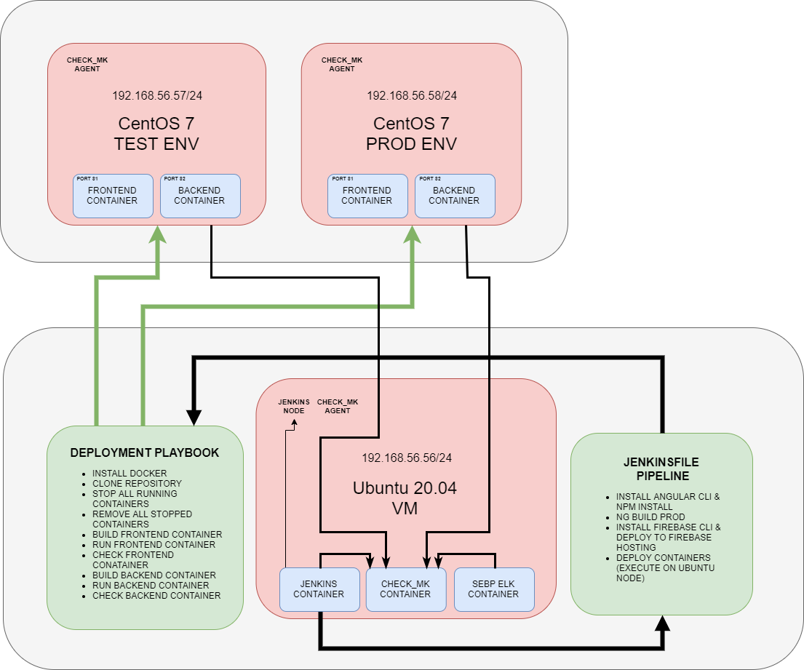

# DevOps On MMCRYPTO.ORG

 

 

## Jenkins
* Pipeline as code

## Ansible
* Two playbooks & One Inventory
* Infrastructure as code
* Deployment Playbook

## Check_MK
* Check_mk_agents

## ELK Stack
* Ubuntu Logs
* Docker Logs
